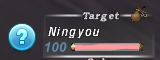

# PartyHints

PartyHints is a graphical addon for Windower4 that displays job icons by party and alliance members
as well as current target.

## Usage
`/check` will load a players job information into memory, if possible.

 

Anonymous players will show a red question mark.

Party members will also automatically be updated when in zone.

Trust jobs are automatically known by the addon.

## Installation

1. Copy the files into your addons directory, usually in `C:\Program Files (x86)\Windower4\addons\`
2. Launch Windower 4
3. Execute `//lua l partyhints` to start the addon, or add it to your `init.txt` file in your scripts to load it at startup.

## Commands

* Usage: `//partyhints [command] [subcommand] [argument]`

| Command | Subcommand | Description |
| --- | --- | --- |
| update | N/A | Forces the graphics to update |
| toggle | party, target, alliance | Toggles display of party, target, or alliance |
| toggle | anon, unknown, self, last | Toggles display of hidden players, players who's job is not yet known, your own icon, and the last icon of the player in the party list |
| target | x \[argument\], y \[argument\] | adjusts x or y position of the target icon in pixels |
| party | x \[argument\], y \[argument\] | adjusts x or y position of the party and alliance icons in pixels |
| help | N/A | display in game help |

## Version

**Author:** rjt

**Version:** 1.3

**Date:** 13/12/22
